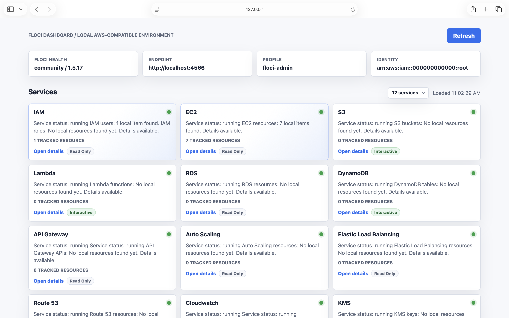

# Floci Dashboard

A small Django UI for inspecting a local [Floci](https://floci.io/) AWS-compatible environment. The dashboard shows Floci health, endpoint/profile/identity details, service cards, resource counts, and service-specific inventory pages.



## What It Shows

- Local Floci health and version
- AWS endpoint, profile, and caller identity
- Clickable service cards for supported local services
- Detail pages for services such as S3, IAM, EC2, AppConfig, Bedrock Runtime, Cost Explorer, EKS, OpenSearch, Pricing, Transcribe, SSM, and more
- Loading state with the Floci cloud image while service data is fetched

## Run Locally On macOS

Clone the project first:

```bash
git clone https://github.com/returnvalue/flocidashboard
cd flocidashboard
```

### Option 1: Use A Virtual Environment

This keeps the Python packages isolated to this project.

```bash
python3 -m venv .venv
source .venv/bin/activate
python3 -m pip install --upgrade pip
pip3 install -r requirements.txt
```

### Option 2: Install Without A Virtual Environment

This installs the packages into your current Python 3 environment.

```bash
pip3 install -r requirements.txt
```

The requirements install the latest available Django and boto3 releases.


Make sure Floci is already running locally on port `4566`.

```bash
export FLOCI_AWS_ENDPOINT_URL=http://localhost:4566
export FLOCI_AWS_REGION=us-east-1
export AWS_ACCESS_KEY_ID=test
export AWS_SECRET_ACCESS_KEY=test
```

Floci 1.5.16 supports the public localhost DNS suffix for virtual-hosted-style S3. The dashboard accepts `localhost.floci.io`, `*.localhost.floci.io`, and the LocalStack-compatible `*.localhost.localstack.cloud` aliases as local endpoints:

```bash
export FLOCI_AWS_ENDPOINT_URL=http://s3.localhost.floci.io:4566
```

If you use an AWS profile for Floci, you can also set:

```bash
export AWS_PROFILE=floci-admin
```

Start the Django dev server:

```bash
python3 manage.py runserver 127.0.0.1:8000
```

Open:

```text
http://127.0.0.1:8000
```

## Configuration

Defaults live in `flocidashboard/settings.py`:

- `FLOCI_AWS_ENDPOINT_URL`: `http://localhost:4566`
- `FLOCI_AWS_REGION`: `us-east-1`
- `FLOCI_AWS_PROFILE`: `floci-admin`

Environment variables override those defaults.

## Quick Check

```bash
python3 manage.py check
```

Then refresh the browser. Service cards should appear once Floci responds.
