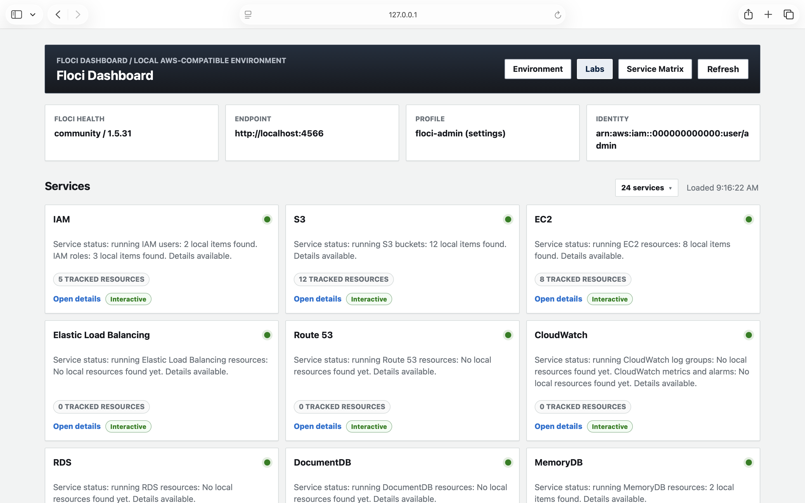

# Floci Dashboard

A small Django UI for inspecting, testing, and learning against a local [Floci](https://floci.io/) AWS-compatible environment. The dashboard uses an AWS-adjacent console style and shows Floci health, endpoint/profile/identity details, selectable service cards, resource counts, service-specific inventory pages, interactive workbenches, and one-click local AWS workflow labs.



## Quickstart

These steps launch Floci and the dashboard together from this repository. They are written for macOS. The dashboard will likely work fine on Windows as well, but Windows has not been tested yet.

Install [Docker Desktop](https://www.docker.com/products/docker-desktop/) if you have not already.

Make sure Docker Desktop is running. You will also need `git` available in your shell.

Paste the following commands into your terminal one at a time, pressing Enter after each one.

Clone the dashboard repository:

```bash
git clone https://github.com/returnvalue/flocidashboard.git
```

Change into the dashboard directory:

```bash
cd flocidashboard
```

Start Floci and the dashboard:

```bash
docker compose up -d
```

Open `http://127.0.0.1:8000` in your browser.

The repo-owned `docker-compose.yml` starts:

- `floci` on `http://127.0.0.1:4566`
- `dashboard` on `http://127.0.0.1:8000`
- a shared `floci_default` Docker network for Floci-spawned containers
- persistent Docker volumes for Floci state and the dashboard SQLite session database

Follow logs while the services start:

```bash
docker compose logs -f
```

Stop everything:

```bash
docker compose down
```

Stop everything and remove local Floci/dashboard state:

```bash
docker compose down -v
```

Copy `.env.example` to `.env` before starting if you want to change exposed ports or local defaults.

### Local Python Development

Docker Compose is the primary path. You can still run Django directly on your host when you want the fastest edit/test loop against an already running Floci container.

Create the virtual environment:

```bash
python3 -m venv .venv
```

Activate the virtual environment:

```bash
source .venv/bin/activate
```

Upgrade `pip` inside the virtual environment:

```bash
python3 -m pip install --upgrade pip
```

Install the dashboard requirements:

```bash
pip3 install -r requirements.txt
```

Set the Floci endpoint URL:

```bash
export AWS_ENDPOINT_URL=http://localhost:4566
```

Set the default AWS region:

```bash
export AWS_DEFAULT_REGION=us-east-1
```

Set the local AWS access key:

```bash
export AWS_ACCESS_KEY_ID=test
```

Set the local AWS secret key:

```bash
export AWS_SECRET_ACCESS_KEY=test
```

Or create and use your own AWS profile for Floci before running the dashboard:

Set your Floci AWS profile:

```bash
export AWS_PROFILE=floci-admin
```

Set the default AWS region:

```bash
export AWS_DEFAULT_REGION=us-east-1
```

Set the Floci endpoint URL:

```bash
export AWS_ENDPOINT_URL=http://localhost:4566
```

`FLOCI_AWS_ENDPOINT_URL` and `FLOCI_AWS_REGION` are also supported if you prefer Floci-specific names. When no explicit profile or credentials are visible to Django, the dashboard falls back to local `test/test` credentials so a fresh Floci install can still show service inventory.

Start the Django dev server:

```bash
python3 manage.py runserver 127.0.0.1:8000
```

When Django runs on your host, use `http://localhost:4566`. When Django runs inside Compose, the dashboard container uses `http://floci:4566`.


## What It Shows

- Local Floci health and version
- Environment diagnostics for AWS endpoint, region, profile, credential source, caller identity, and local-endpoint warnings
- Clickable service cards for supported local services, with a top-24 default home view, persisted home-page service filtering, and a Tracked Resources view that shows only services with discovered resources
- Service Matrix coverage page showing registry maturity, API paths, shared console status, action counts, tags, and linked service pages
- Labs directory at `/labs/` showing every service with active workflow labs, current lab counts, runnable step counts, and direct links
- Activity page at `/activity/` with browser-local recent API Gateway requests, EventBridge events, Lambda invokes, and SQS sends/receives, plus links back to activity-enabled workbenches for safe replay or prefill
- AWS CLI Console at `/console/` for running AWS-only CLI commands against the active local Floci endpoint, with endpoint injection, JSON parsing, a draggable curated command palette, command history, and destructive-command confirmation
- AWS-adjacent console shell with shared Environment, Labs, Service Matrix, and Refresh navigation across primary pages
- Global service navigation with `Cmd/Ctrl+K` search, local favorites, recently visited services, and filtered service collections
- Local AWS workflow labs for IAM, S3, SQS, SNS, EventBridge Scheduler, CloudFormation, EC2 networking, Lambda, API Gateway, DynamoDB, KMS, SSM Parameter Store, and Secrets Manager, with exact AWS CLI commands, approved one-click execution, live-state verification, reset actions, next-batch recommendations after a service batch is complete, and breadcrumb navigation back to the service or homepage
- Interactive workbenches for S3, IAM, EC2, SQS, SNS, Lambda, DynamoDB, CloudWatch Logs, Step Functions, EventBridge, EventBridge Pipes, EventBridge Scheduler, API Gateway, AppSync, Kinesis, KMS, Secrets Manager, SSM Parameter Store, CloudFormation, Cognito, AWS Config, RDS, Auto Scaling, ELB v2, CloudFront, AWS Cloud Map, Route 53, ACM, ECS, ECR, EKS, ElastiCache, OpenSearch, Athena, Backup, Firehose, Glue, Kafka, Neptune, SES, Transfer Family, Textract, Transcribe, CodeDeploy, CodeBuild, Bedrock Runtime, AppConfig, and Resource Groups Tagging
- IAM-focused identity tooling with user, group, role, managed policy, inline policy, access key, role trust, instance profile, cleanup, policy simulation, session identity switching, assumed-role credential, and tutorial/lab workflows
- Inventory pages for newer Floci services including Amazon MQ, EMR, WAF v2, AWS Batch, RDS Data API, Amazon DocumentDB, MemoryDB, CodePipeline, S3 Vectors, IoT Core, and Elastic Beanstalk
- Inventory pages for read-only or newly surfaced services such as CloudTrail and Cloud Control
- Detail pages for services such as Cost Explorer, Cost and Usage Reports, BCM Data Exports, Pricing, and more
- Expanded inventory for EC2 VPC endpoints, EC2 Network ACLs, EC2 VPC Flow Logs, CloudFormation StackSets, SES v2 contact lists, and SSM default patch baselines, plus KMS key enable/disable actions and richer S3 object metadata
- Release-aware service notes refreshed through Floci 1.5.31, including a Cloud Control resource-discovery page, CloudWatch Logs Insights, RDS Data API for PostgreSQL, RDS mock mode, read-only resource APIs, Lambda cold-start and persistence improvements, EC2 image/snapshot catalogs, EventBridge-to-Firehose delivery, Scheduler ECS targets, Step Functions S3 ItemReader and qualified Lambda ARN support, Secrets Manager BatchGetSecretValue filtering, API Gateway API key persistence, and Elastic Beanstalk persistence
- Loading state with the Floci cloud image while service data is fetched

## Local AWS Workflow Labs

The Labs directory at `/labs/` lists every service with curated labs. Individual service pages also link to their own lab batches when labs are available.

Labs show the AWS CLI command shape without local endpoint plumbing. Each Run button invokes a registered boto3-backed action, displays the response, and independently verifies the result against live Floci state. Reset removes only the resources owned by that lab. When the final lab in a service batch is complete, the lab page recommends the next batch in the practical learning order: IAM, S3, SQS, SNS, EventBridge Scheduler, CloudFormation, EC2 networking, Lambda, API Gateway, DynamoDB, KMS, SSM Parameter Store, and Secrets Manager.

The curriculum includes eleven IAM labs, twelve S3 labs, nine SQS labs, two SNS labs, one EventBridge Scheduler lab, one CloudFormation lab, four EC2 networking labs, three Lambda labs, one API Gateway lab, two DynamoDB labs, one KMS lab, one SSM Parameter Store lab, and one Secrets Manager lab. It covers creating a local admin identity, IAM users, policies, access keys, groups, roles, STS session policies, instance profiles, switched dashboard identities, and permission-enforcement checks; S3 buckets, objects, prefixes, metadata, tags, versioning, presigned URLs, security, encryption, lifecycle retention, CORS, S3-to-SQS notifications, and multipart uploads; SQS queue inspection, message lifecycle, visibility timeout behavior, delayed delivery, batch operations, queue configuration, dead-letter queues, managed redrive, FIFO ordering, duplicate suppression, purge, and queue deletion; SNS-to-SQS fan-out, resource policies, raw delivery, and subscription filtering; scheduled SQS delivery through a scoped IAM execution role; infrastructure-as-code ownership of S3 and SQS resources; public/private VPC routing; stateful security-group traffic controls; private S3 connectivity through a gateway endpoint; private SQS connectivity through an HTTPS-only interface endpoint with private DNS; Lambda creation, invocation, runtime SSM and Secrets Manager reads, SQS event source mappings, and CloudWatch Logs inspection; API Gateway HTTP API routing to Lambda; DynamoDB table CRUD, query, and Lambda-write workflows; KMS key, alias, encrypt, and decrypt round trips; hierarchical SSM application configuration; and Secrets Manager secret creation, reads, and value updates.

Lab definitions and implementation notes live in [`buildinglabs.md`](./buildinglabs.md).

## Configuration

Host-development defaults live in `flocidashboard/settings.py`:

- `FLOCI_AWS_ENDPOINT_URL`: `http://localhost:4566`
- `FLOCI_AWS_REGION`: `us-east-1`
- `FLOCI_AWS_PROFILE`: `floci-admin`

Environment variables override those defaults. If `floci-admin` is not configured locally, the dashboard uses local `test/test` credentials instead of failing the homepage with missing-credential cards.

The Docker Compose quickstart overrides the endpoint to `http://floci:4566` inside the dashboard container and uses local `test/test` credentials by default. Compose defaults can be overridden in `.env`; see `.env.example` for the supported ports, credentials, and Floci runtime toggles.

## Quick Check

```bash
docker compose exec dashboard python manage.py check
```

Then refresh the browser. Service cards should appear once Floci responds.

For host Python development, run the same check from your activated virtual environment:

```bash
python3 manage.py check
```

## Contributor Architecture Notes

The dashboard uses a shared service workbench architecture. New service features should build on the shared shell, registry, action, lab, and inspector pieces instead of replacing existing inventory pages.

Core files:

- `dashboard/services.py`: canonical service registry. Add service metadata, maturity, optional CSS/JS assets, and action metadata here.
- `dashboard/actions.py`: shared action metadata plus JSON parsing and error normalization helpers for interactive service endpoints.
- `dashboard/aws.py`: read-only inventory loaders and release-aware service summaries. Keep fresh local Floci instances graceful with empty/error shapes.
- `dashboard/labs/`: curated workflow lab package. `registry.py`, `runner.py`, and `types.py` expose the shared lab API, while `monolith.py` temporarily holds the existing service definitions, approved runners, live-state verification, and reset behavior during incremental service-module extraction.
- `dashboard/views.py`: shared page/API views for home, environment, settings shell, service pages, lab pages, lab progress, lab reset, and inventory endpoints that do not need a focused service view module.
- `dashboard/settings_views.py`: Settings API for endpoint/profile details, endpoint overrides, reset behavior, and connection testing.
- `dashboard/inspector_api.py` and `dashboard/inspector_views.py`: shared local payload inspector for SQS messages, SES mailbox messages, and Lambda logs.
- `dashboard/console_views.py`, `dashboard/templates/dashboard/console.html`, and `dashboard/static/dashboard/console.js`: AWS-only CLI Console for local Floci commands. It accepts `aws ...` commands, rejects shell operators and server file reads, injects the active local endpoint, and confirms destructive operations.
- `Dockerfile`, `docker-compose.yml`, `.dockerignore`, and `.env.example`: Docker-first local runtime. Compose starts Floci and Django together, puts the dashboard on the shared `floci_default` network, points the containerized dashboard at `http://floci:4566`, and keeps host Python development available as an optional fast loop.
- `dashboard/templates/dashboard/base.html`: global shell with shared CSS/JS, CSRF metadata, and the collapsible global service navigation mount.
- `dashboard/templates/dashboard/service.html`: common service page shell. Interactive workbenches should be layered into this page while keeping the original read-only inventory visible.
- `dashboard/templates/dashboard/activity.html` and `dashboard/static/dashboard/activity.js`: browser-local recent activity view for replayable developer actions from activity-enabled service workbenches.
- `dashboard/templates/dashboard/labs_directory.html` and `dashboard/static/dashboard/labs-directory.js`: labs directory, async lab completion summary, and global completed-lab reset behavior.
- `dashboard/templates/dashboard/labs.html` and `dashboard/static/dashboard/labs.js`: shared workflow-lab UI and browser behavior.
- `dashboard/static/dashboard/service-console.js`: shared browser-side helpers for API calls, summary cards, read-only cards, toolbars, modals, formatting, recent activity storage, and lower-right toasts.
- `dashboard/static/dashboard/dashboard.js`: generic read-only inventory rendering, global service navigation, status popover, service search, Activity link, favorites, recently visited services, and shared page refresh behavior.
- `dashboard/static/dashboard/styles.css`: primary shared visual system for global navigation, page shells, service pages, labs, settings, inspector, and responsive behavior.
- `dashboard/static/dashboard/console-theme.css`: shared AWS-adjacent compatibility layer that keeps service-specific console pages visually aligned while service CSS is cleaned up incrementally.
- Service-specific files such as `s3_api.py`, `s3_views.py`, `s3-console.js`, and `s3-console.css`, `iam_api.py`, `iam_views.py`, `iam-console.js`, and `iam-console.css`, `ec2_api.py`, `ec2_views.py`, `ec2-console.js`, and `ec2-console.css`, `cloudformation_api.py`, `cloudformation_views.py`, `cloudformation-console.js`, and `cloudformation-console.css`, `cognito_api.py`, `cognito_views.py`, `cognito-console.js`, and `cognito-console.css`, `rds_api.py`, `rds_views.py`, `rds-console.js`, and `rds-console.css`, `autoscaling_api.py`, `autoscaling_views.py`, `autoscaling-console.js`, and `autoscaling-console.css`, `elasticloadbalancing_api.py`, `elasticloadbalancing_views.py`, `elasticloadbalancing-console.js`, and `elasticloadbalancing-console.css`, `cloudfront_api.py`, `cloudfront_views.py`, `cloudfront-console.js`, and `cloudfront-console.css`, `cloudmap_api.py`, `cloudmap_views.py`, `cloudmap-console.js`, and `cloudmap-console.css`, `route53_api.py`, `route53_views.py`, `route53-console.js`, and `route53-console.css`, `acm_api.py`, `acm_views.py`, `acm-console.js`, and `acm-console.css`, `ecs_api.py`, `ecs_views.py`, `ecs-console.js`, and `ecs-console.css`, `ecr_api.py`, `ecr_views.py`, `ecr-console.js`, and `ecr-console.css`, `eks_api.py`, `eks_views.py`, `eks-console.js`, and `eks-console.css`, `elasticache_api.py`, `elasticache_views.py`, `elasticache-console.js`, and `elasticache-console.css`, `opensearch_api.py`, `opensearch_views.py`, `opensearch-console.js`, and `opensearch-console.css`, `athena_api.py`, `athena_views.py`, `athena-console.js`, and `athena-console.css`, or the equivalent files for SQS, SNS, Lambda, DynamoDB, CloudWatch Logs, Step Functions, EventBridge, API Gateway, AppSync, Kinesis, Secrets Manager, SSM Parameter Store, Backup, Firehose, Glue, Kafka, Neptune, SES, Transfer Family, Textract, Transcribe, CodeDeploy, CodeBuild, Bedrock Runtime, AppConfig, and Resource Groups Tagging: focused behavior for one service only.

Important conventions:

- Treat interactive workbenches as additive. Do not remove summary cards, anchor-link behavior, read-only inventory cards, supported-operation panels, or service notes.
- Treat labs as curated workflows rather than a browser terminal. The browser sends registered service/lab/step identifiers and never arbitrary shell commands.
- Treat the AWS CLI Console as an AWS command runner, not a shell. Keep it limited to `aws ...`, run with `shell=False`, reject shell operators and server file inputs, and preserve local-endpoint validation.
- Derive lab completion from live Floci state whenever possible, keep reset ownership explicit, and keep expensive all-lab progress checks asynchronous from `/labs/`.
- Preserve the global shell. Shared navigation, search, favorites, recently visited services, Settings, Inspector, and collapsible sidebars should continue to work across page types.
- Register service capabilities in `dashboard/services.py` before wiring service-specific UI.
- Use `dashboard/actions.py` helpers for JSON request parsing and normalized action errors.
- Use `ServiceConsole.toast()` for action feedback. Interactive success and failure messages should appear as lower-right toasts.
- Use `ServiceConsole.recordActivity()` only for developer-initiated actions that are useful to revisit, such as API Gateway request tests, EventBridge PutEvents calls, Lambda invokes, and SQS sends/receives. Do not record passive inventory refreshes or background polling.
- Keep action placement scoped to what the action affects. Resource-specific actions belong with the selected resource, detail card, row, or drawer they mutate, such as `Use this user`, `Delete this queue`, `Invoke this function`, `Reveal this secret`, or `Attach policy to this role`. Global actions that are not tied to one selected resource, such as refresh, create, import, reset-all, filters, and broad page utilities, belong in the page or workbench toolbar. Bulk actions should live near the collection selection controls.
- Keep service-specific JavaScript focused on that service's workflow. Prefer shared helpers from `service-console.js` for common UI behavior.
- Keep destructive actions explicit. Add destructive action metadata with confirmation text.
- Use focused modules for specialized APIs. Service action endpoints belong in `<service>_views.py` when they need more than the generic inventory view; cross-service inspection belongs in `inspector_api.py` and `inspector_views.py`; runtime configuration belongs in `settings_views.py`.
- Add focused tests for registry metadata, page rendering, and each new action endpoint.

New service checklist:

- Add the service to `dashboard/services.py` with title, category, maturity, docs URL when available, tags, optional static assets, and action metadata if it has interactive workflows.
- Add or extend inventory loading in `dashboard/aws.py`, including a graceful empty/error shape for fresh local Floci instances.
- Add the API route and view in `dashboard/urls.py` and `dashboard/views.py`, or a focused `<service>_views.py` when the service needs action endpoints.
- Confirm the generic service page renders via `dashboard/templates/dashboard/service.html`; add service-specific JS/CSS only when the workflow needs it.
- Place resource-scoped buttons with the resource, row, detail card, or drawer they act on; keep only global page/workbench actions in the toolbar.
- Register homepage resource loading in the resource loader map when the service should appear on the home dashboard.
- Add focused tests for registry metadata, service page rendering, inventory/API behavior, and each action endpoint.
- Add or update Settings, Inspector, Labs, and global navigation tests when a change touches those shared surfaces.
- Add or update Activity page tests when a service starts writing browser-local replay/prefill entries.
- Keep action metadata paths, route coverage, and action endpoint tests in sync; `ActionRegistryAuditTests` flags stale registry paths and missing action test coverage.
- Run JS syntax checks for any changed console assets; `dashboard.tests.StaticJavaScriptTests` also checks dashboard JS during the test suite.
- Update `ROADMAP.md` with the coverage note, maturity change, or follow-up gaps so contributors can see what changed and what remains.

Recommended checks before opening a PR:

```bash
python3 manage.py test dashboard
python3 manage.py test dashboard.tests.ActionRegistryAuditTests
python3 manage.py check
node --check dashboard/static/dashboard/service-console.js
node --check dashboard/static/dashboard/<service>-console.js
```

Use the changed service page, Labs, Service Matrix, and homepage in the browser as final sanity checks when the change affects those surfaces.

## Prompt For AI-Assisted Contributors

If you are using Codex, Claude, or another local coding assistant to add a dashboard feature, start with a prompt like this:

```text
You are contributing to the Floci Dashboard Django app. Before editing, read README.md, ROADMAP.md, dashboard/services.py, dashboard/actions.py, dashboard/aws.py, dashboard/views.py, dashboard/templates/dashboard/base.html, dashboard/templates/dashboard/service.html, dashboard/static/dashboard/dashboard.js, dashboard/static/dashboard/service-console.js, dashboard/static/dashboard/styles.css, and the closest existing workbench implementation. If your change touches labs, also read dashboard/labs/registry.py, dashboard/labs/runner.py, dashboard/labs/types.py, dashboard/labs/monolith.py, dashboard/templates/dashboard/labs.html, dashboard/templates/dashboard/labs_directory.html, dashboard/static/dashboard/labs.js, and dashboard/static/dashboard/labs-directory.js. If your change touches runtime configuration, Docker-first startup, endpoint validation, or inspection tools, also read Dockerfile, docker-compose.yml, .env.example, flocidashboard/settings.py, dashboard/settings_views.py, dashboard/static/dashboard/settings.js, dashboard/inspector_api.py, dashboard/inspector_views.py, dashboard/templates/dashboard/inspector.html, and dashboard/static/dashboard/inspector.js.

Good service references are S3 for object browsing, IAM for identity and policy workflows, EC2 for local compute and networking workflows, SQS/SNS for messaging, Lambda for invoke/test workflows, DynamoDB for table and item workflows, CloudWatch Logs for recent event viewing and Logs Insights, Cloud Control for unified resource discovery, Step Functions for execution workflows, EventBridge for event routing tests, EventBridge Pipes and Scheduler for event routing lifecycle workflows, API Gateway for request testing, AppSync for GraphQL management workflows, Kinesis for stream records, KMS for key workflows, Secrets Manager for secret value workflows, SSM for Parameter Store workflows, CloudFormation for stack workflows, Cognito for local auth workflows, AWS Config for compliance setup workflows, RDS for database lifecycle workflows, Auto Scaling for capacity workflows, ELB v2 for load-balancing topology workflows, CloudFront for CDN management workflows, AWS Cloud Map for service discovery workflows, Route 53 for DNS management workflows, ACM for certificate workflows, ECS for container orchestration workflows, ECR for image registry workflows, EKS for Kubernetes cluster and node group workflows, ElastiCache for cache/user/IAM auth workflows, OpenSearch for search domain workflows, Athena for SQL query workflows, Backup for plan/job workflows, Firehose for stream delivery, Glue for database/table catalog and schema registry workflows, Kafka for cluster bootstrap and broker endpoints, Neptune for graph cluster and instance lifecycle, SES for email identities and templates, Transfer Family for SFTP server and user management workflows, Textract and Transcribe for stub AI workflows, CodeDeploy and CodeBuild for local delivery workflows, Bedrock Runtime for stub model requests, AppConfig for configuration deployment and retrieval, Resource Groups Tagging for centralized tag discovery, CloudTrail for read-only audit trail inventory, and the Inspector page for cross-service local payload inspection.

Goal: add or improve the <SERVICE> dashboard feature.

Architecture rules:
- Preserve the existing service page and read-only inventory. Interactive workbenches are additive, not replacements.
- Register service metadata, maturity, optional assets, and action metadata in dashboard/services.py.
- Use dashboard/actions.py for JSON parsing and normalized action errors.
- Use the shared ServiceConsole helpers for API calls, summary rendering, modals, toolbars, formatting, and lower-right toasts.
- Keep service-specific JS/CSS focused on the service workflow only.
- Use destructive action confirmations for delete, purge, reset, empty, or cleanup actions.
- Preserve the global shell in dashboard/templates/dashboard/base.html and dashboard/static/dashboard/dashboard.js, including the collapsible global service navigation, search, favorites, recently visited services, status popover, Settings link, Inspector link, and refresh behavior.
- Treat labs as registered workflows, not browser shell access. The browser sends service/lab/step identifiers only; runners stay allowlisted; verification reads live Floci state; reset ownership stays explicit; expensive all-lab progress checks stay async from /labs/.
- Keep runtime configuration changes inside Settings surfaces and APIs. Endpoint/profile overrides, reset, and connection tests belong in dashboard/settings_views.py and dashboard/static/dashboard/settings.js.
- Keep cross-service payload browsing inside Inspector surfaces and APIs. SQS messages, SES mailbox messages, and Lambda logs belong in dashboard/inspector_api.py, dashboard/inspector_views.py, and dashboard/static/dashboard/inspector.js unless a service-specific workflow truly needs local behavior.
- Preserve fresh local startup behavior. The Docker quickstart must work with FLOCI_AWS_ENDPOINT_URL/AWS_ENDPOINT_URL set to `http://floci:4566`; host Python development must still work with `http://localhost:4566`; neither path may assume a floci-admin profile exists.
- If changing auth, identity, health, or homepage loading behavior, keep missing Floci and missing/partial AWS credentials graceful: show helpful status messages and display any inventory that can still be loaded.
- Preserve the Docker-first quickstart. The cloned repo should launch Floci and the dashboard together with `docker compose up -d`; host `runserver` instructions are secondary development notes.
- Add focused tests for registry metadata, service page rendering, action endpoints, and any touched shared surfaces such as Labs, Settings, Inspector, global navigation, or static JavaScript.

Implementation request:
1. Inspect the existing inventory shape for <SERVICE>.
2. Propose the smallest useful interactive workbench for common local development workflows.
3. Implement it in the shared architecture.
4. Keep the original read-only cards visible under the new workbench.
5. Run python3 manage.py test dashboard, docker compose exec dashboard python manage.py check, and node --check for any changed console, dashboard, labs, settings, or inspector JavaScript. If the change touches Docker or runtime configuration, also run docker compose config.
6. Summarize changed files, behavior, tests run, and any known follow-ups.
```
